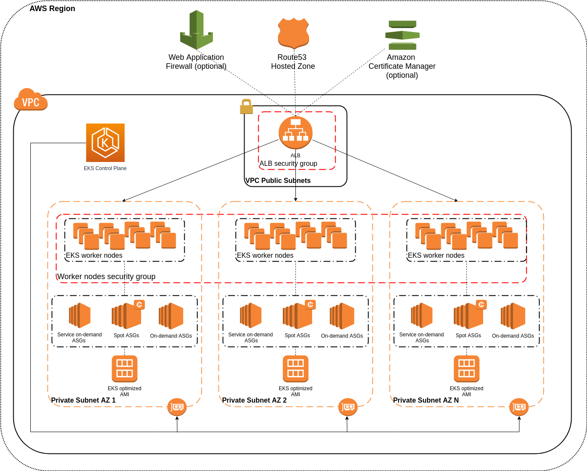
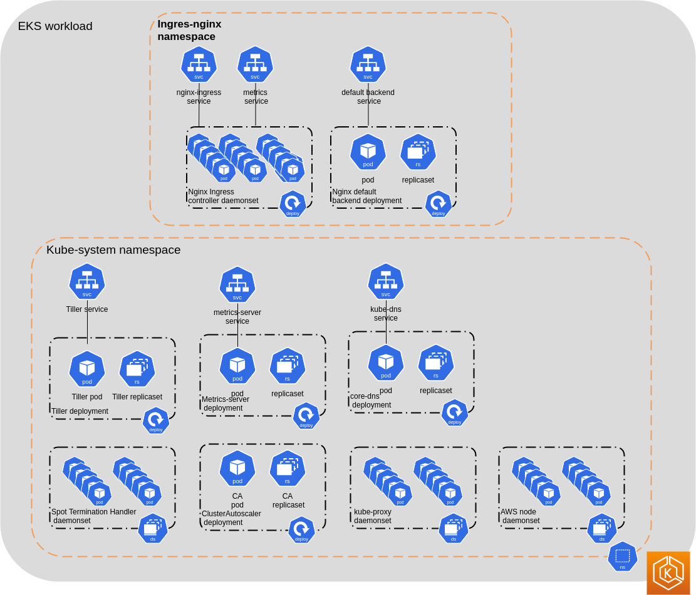
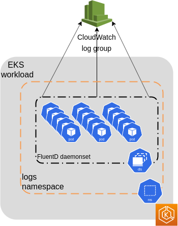
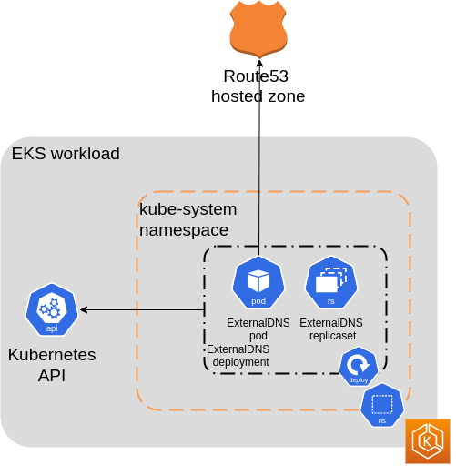
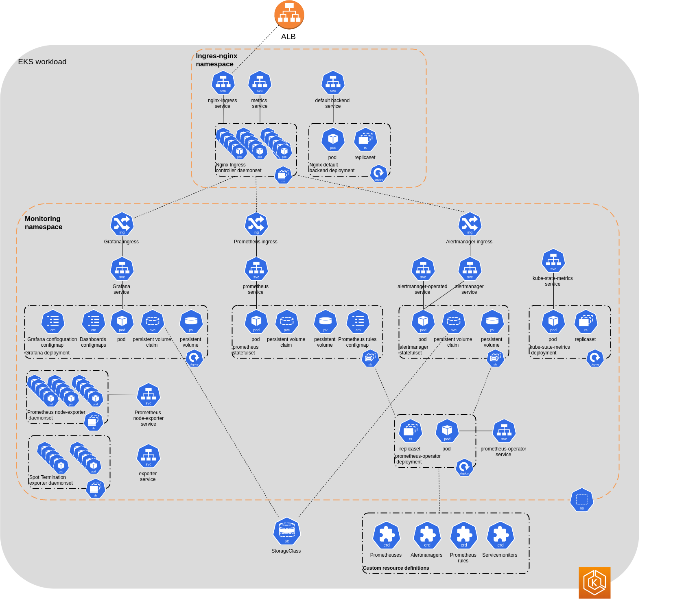

# Terraform EKS module

## Description

Module provisions scalable EKS cluster with EC2 spot instances as worker nodes.
By defaut terraform code will provision EKS cluster, IAM roles for worker nodes and cluster, additional IAM policies, security groups, instance profile, autoscaling groups and launch configurations for spot and on-demand worker nodes (autoscaling groups will be created per AZ for each launch configuration), ALB, Route53 record for ALB, target group. Also module will deploy [cluster-autoscaler](https://github.com/kubernetes/autoscaler/tree/cluster-autoscaler-1.16.1/cluster-autoscaler), [spot termination handler](https://github.com/banzaicloud/banzai-charts/tree/master/spot-termination-handler), [tiller](https://helm.sh/docs/glossary/#tiller),  [metric server](https://github.com/helm/charts/tree/master/stable/metrics-server#metrics-server) and [nginx-ingress-controller](https://github.com/kubernetes/ingress-nginx#nginx-ingress-controller).

## Deployment diagram:



## Default EKS deployments:



Optionally following features can be enabled:
 * ACM certificate for ALB;
 * AWS WAF for whitelisting;
 * deploy [fluend](https://github.com/helm/charts/tree/master/incubator/fluentd-cloudwatch#fluentd-cloudwatch) for container logs aggregation. Logs will be stored in AWS CloudWatch logs group:

   
 * deploy [external-dns](https://github.com/kubernetes-incubator/external-dns#externaldns) service:

   
 * deploy [prometheus-operator](https://github.com/coreos/prometheus-operator#prometheus-operator) with [Grafana](https://github.com/helm/charts/tree/master/stable/grafana#grafana-helm-chart):
   


## Requirements

Folloving resources shoud be created before cluster provisioning:
 * AWS VPC - https://docs.aws.amazon.com/eks/latest/userguide/network_reqs.html
 * AWS Route53 HostedZone

 | Tool       | Version   |
 | ---------- | --------- |
 | terraform  | ==0.11.14  |
 | kubectl    | >=1.13.4   |
 | helm       | ==2.13.1   |
 | aws-cli    | ==1.16.140  |
 | aws-iam-authenticator   |  ==1.12.7  |

## NOTES
 * rendered manifests and Helm charts for Kubernetes will be available in ${path.root}/manifests_rendered. Store it for further edition if required.

## Usage

```HCL
provider "aws" {
  region  = "us-east-1"
}

module "core" {
  source = "github.com/lean-delivery/tf-module-aws-core?ref=v0.2"

  project            = "eks"
  environment        = "test"
  availability_zones = ["us-east-1b","us-east-1c"]
  vpc_cidr           = "10.12.0.0/21"
  private_subnets    = ["10.12.0.0/24","10.12.1.0/24"]
  public_subnets     = ["10.12.2.0/24","10.12.3.0/24"]

  enable_nat_gateway = "true"
}

module "eks_test" {
  source = "github.com/lean-delivery/tf-module-aws-eks?ref=v1.0"

  project      = "eks"
  environment  = "test"

  cluster_version = "1.14"
  cluster_enabled_log_types = ["api"]

  vpc_id          = "${module.core.vpc_id}"
  private_subnets = "${module.core.private_subnets}"
  public_subnets  = "${module.core.public_subnets}"

  spot_configuration = [
      {
        instance_type = "m4.large",
        spot_price    = "0.05",
        asg_max_size  = "4",
        asg_min_size  = "0",
        asg_desired_capacity = "0",
        additional_kubelet_args = ""
      },
      {
        instance_type = "m4.xlarge",
        spot_price    = "0.08",
        asg_max_size  = "4",
        asg_min_size  = "1",
        asg_desired_capacity = "1",
        additional_kubelet_args = ""
      },
      {
        instance_type = "m4.2xlarge",
        spot_price    = "0.15",
        asg_max_size  = "4",
        asg_min_size  = "0",
        asg_desired_capacity = "0",
        additional_kubelet_args = ""
      }
    ]


  on_demand_configuration = [
      {
        instance_type = "m4.xlarge",
        asg_max_size  = "6",
        asg_min_size  = "0",
        asg_desired_capacity = "0",
        additional_kubelet_args = ""
      }
    ]

  service_on_demand_configuration = [
      {
        instance_type = "t3.small",
        asg_max_size  = "1",
        asg_min_size  = "1",
        asg_desired_capacity = "1",
        additional_kubelet_args = ""
      }
    ]

  worker_nodes_ssh_key      = "ssh-rsa AAAAB3NzaC1yc2EAAAADAQABAAABAQDmYWeU1Hm+KfNmnOhB1OVh58KVcetUp6URTPB6fEOmIoNpXXpwFNeotjPoyFwwNc6KJ3LtDOo/Gx9SBkx9sSrHZcJVrKXRF/h4fe4nWeuoz0l3e8Toq+UajIXPjtv+mXkUX5LeyWKwInGc9U3BHXhzV8BYz9i1UqPDDvNsmep5gdRukI327Rh1G+kAYuhivvxbrzsIQrLUMjHqTiL25yILHZJ/eCJvcqLBXtxkPJThytVC1WUZ4vKQ5g8Ley6CtEa/7HolH6RlGduHswzqcdjrSMNxXPoSLF0j4cOeRy7MQA3TU4cLBgcmrwGgE5/IjBy3/3e15D3jtu8jX0r+tUR3 user@example.com"
  root_domain               = "eks.example.com"
  target_group_port         = "30081"

  deploy_nginx_ingress       = true
  deploy_external_dns             = true
  enable_container_logs           = true
  container_logs_retention_days   = "5"
  enable_monitoring               = true
  monitoring_availability_zone    = "us-east-1c"
}
```

## Inputs

| Name | Description | Type | Default | Required |
|------|-------------|:----:|:-----:|:-----:|
| alb\_ingress\_rules | List of maps that contains ingress rules for ALB security group | list | `[{from_port = 80, to_port = 80, protocol = "tcp", cidr_blocks = "0.0.0.0/0"}, {from_port = 443, to_port = 443, protocol = "tcp", cidr_blocks = "0.0.0.0/0"}]` | no |
| alb\_route53\_record | Alias Route53 DNS record name for ALB | string | n/a | yes |
| alternative\_domains | Alternative domains for ACM certificate dns records with ',' as delimiter | list | `[]` | no |
| alternative\_domains\_count | Alternative domains count for ACM certificate | string | `"0"` | no |
| service\_on\_demand\_configuration | List of maps that contains configurations for ASGs with on-demand workers instances what will be used in EKS-cluster | list | `[{ instance_type = "t3.small", asg_max_size  = "1", asg_min_size  = "1", asg_desired_capacity = "1", additional_kubelet_args = ""}]` | no |
| cidr\_whitelist | List of maps that contains IP CIDR with protocol type. Example provided in module examples | list | `[]` | no |
| cluster\_enabled\_log\_types | A list of the desired control plane logging to enable. For more information, see [Amazon EKS Control Plane Logging documentation](https://docs.aws.amazon.com/eks/latest/userguide/control-plane-logs.html) | list | `[]` | no |
| cluster\_version | Kubernetes version to use for the EKS cluster. | string | `"1.14"` | no |
| container\_logs\_retention\_days | Set retention period for AWS CloudWatch log group with container logs | string | `"5"` | no |
| create\_acm\_certificate | Set true for ACM certificate for ALB creation | string | `"true"` | no |
| deploy\_external\_dns | Set true for [External DNS](https://github.com/kubernetes-incubator/external-dns#externaldns) installation. | string | `"false"` | no |
| deploy\_ingress\_controller | Set true for [nginx ingress controller](https://github.com/kubernetes/ingress-nginx#nginx-ingress-controller) installation | string | `"true"` | no |
| enable\_container\_logs | Set true to install [fluentd](https://github.com/helm/charts/tree/master/incubator/fluentd-cloudwatch#fluentd-cloudwatch) and store container logs in AWS CloudWatch log group | string | `"false"` | no |
| enable\_monitoring | Set true for [prometheus-operator](https://github.com/helm/charts/tree/master/stable/prometheus-operator#prometheus-operator) and [grafana](https://github.com/helm/charts/tree/master/stable/grafana#grafana-helm-chart) deployment. Also storageClass will be created. | string | `"false"` | no |
| environment | Environment name is used to identify resources | string | n/a | yes |
| local\_exec\_interpreter | Command to run for local-exec resources. Must be a shell-style interpreter. If you are on Windows Git Bash is a good choice. | list | `["/bin/sh", "-c"]` | no |
| map\_accounts | Additional AWS account numbers to add to the aws-auth configmap. See [variables.tf](https://github.com/terraform-aws-modules/terraform-aws-eks/blob/v4.0.0/examples/eks_test_fixture/variables.tf) for example format. | list | `<list>` | no |
| map\_accounts\_count | The count of accounts in the map_accounts list. | string | `"0"` | no |
| map\_roles | Additional IAM roles to add to the aws-auth configmap. See [variables.tf](https://github.com/terraform-aws-modules/terraform-aws-eks/blob/v4.0.0/examples/eks_test_fixture/variables.tf) for example format. | list | `<list>` | no |
| map\_roles\_count | The count of roles in the map_roles list. | string | `"0"` | no |
| map\_users | Additional IAM users to add to the aws-auth configmap. See [variables.tf](https://github.com/terraform-aws-modules/terraform-aws-eks/blob/v4.0.0/examples/eks_test_fixture/variables.tf) for example format. | list | `<list>` | no |
| map\_users\_count | The count of roles in the map_users list. | string | `"0"` | no |
| monitoring\_availability\_zone | Availability zone in which will be deployed grafana and prometheus-operator, as this deployments required persistent volumes for data storing. If variable not set - availability zone of first subnet in private_subnets array will be used. | string | `""` | no |
| on\_demand\_configuration | List of maps that contains configurations for ASGs with on-demand workers instances what will be used in EKS-cluster | list | `[{instance_type = "m4.xlarge", asg_max_size  = "6", asg_min_size  = "0", asg_desired_capacity = "0", additional_kubelet_args = ""}]` | no |
| private\_subnets | List of private subnets for cluster worker nodes provisioning | list | n/a | yes |
| project | Project name is used to identify resources | string | n/a | yes |
| public\_subnets | List of public subnets for ALB provisioning | list | n/a | yes |
| root\_domain | Root domain in which custom DNS record for ALB would be created | string | n/a | yes |
| spot\_configuration | List of maps that contains configurations for ASGs with spot workers instances what will be used in EKS-cluster | list | `[{instance_type = "m4.large", spot_price = "0.05", asg_max_size  = "4", asg_min_size  = "1", asg_desired_capacity = "1", additional_kubelet_args = ""}, {instance_type = "m4.xlarge", spot_price    = "0.08", asg_max_size  = "4", asg_min_size  = "0", asg_desired_capacity = "0", additional_kubelet_args = ""}]` | no |
| target\_group\_port | ALB targer group port. This value will be used as NodePort for Nginx Ingress controller service. | string | `"30080"` | no |
| volume\_size | Volume size(GB) for worker node in cluster | string | `"50"` | no |
| vpc\_id | VPC ID for cluster provisioning | string | n/a | yes |
| worker\_nodes\_ssh\_key | If Public ssh key provided, will be used for ssh access to worker nodes. Otherwise instances will be created without ssh key. | string | `""` | no |

## Outputs

| Name | Description |
|------|-------------|
| acm\_certificate\_arn | ACM certificate arn for ALB. |
| acm\_certificate\_domain | ACM certificate domain for ALB. |
| alb\_arn | ALB arn for access to EKS deployments webUI. |
| alb\_dns\_name | ALB dns name for access to EKS deployments webUI. |
| alb\_http\_listener\_arn | ALB http listener arn. |
| alb\_https\_listener\_arn | ALB https listener arn. |
| alb\_security\_group\_arn | ALB security group arn. |
| alb\_security\_group\_id | ALB security group id. |
| alb\_security\_group\_name | ALB security group name. |
| alb\_target\_group\_arn | ALB target group arn. |
| alb\_target\_group\_name | ALB target group name. |
| cluster\_arn | The Amazon Resource Name (ARN) of the cluster. |
| cluster\_certificate\_authority\_data | EKS cluster certificate. |
| cluster\_endpoint | EKS cluster API endpoint. |
| cluster\_iam\_role\_arn | IAM role ARN of the EKS cluster. |
| cluster\_iam\_role\_name | IAM role name of the EKS cluster. |
| cluster\_id | EKS cluster id. |
| cluster\_security\_group\_id | EKS cluster security group id. |
| cluster\_version | EKS cluster version. |
| config\_map\_aws\_auth | A kubernetes configuration to authenticate to this EKS cluster. |
| iam\_instance\_profile\_name | IAM instance profile name for EKS worker nodes. |
| kubeconfig | kubectl config file contents for this EKS cluster. |
| kubeconfig\_filename | The filename of the generated kubectl config. |
| launch\_configuration\_on\_demand\_asg\_names | Launch configuration name for EKS on-demand worker nodes. |
| launch\_configuration\_service\_on\_demand\_asg\_names | Launch configuration name for EKS non-scalable on-demand worker nodes. |
| launch\_configuration\_spot\_asg\_names | Launch configurations names for EKS spot worker nodes. |
| on\_demand\_asg\_arns | EKS on-demand worker nodes ASGs arns. |
| on\_demand\_asg\_ids | EKS on-demand worker nodes ASGs IDs. |
| on\_demand\_asg\_names | EKS on-demand worker nodes ASGs names. |
| service\_on\_demand\_asg\_arns | EKS non-scalable on-demand worker nodes ASGs arns. |
| service\_on\_demand\_asg\_ids | EKS non-scalable on-demand worker nodes ASGs IDs. |
| service\_on\_demand\_asg\_names | EKS non-scalable on-demand worker nodes ASGs names. |
| path\_to\_manifests | Path to rendered manifests for EKS deployments. |
| spot\_asg\_arns | EKS spot worker nodes ASGs arns. |
| spot\_asg\_ids | EKS spot worker nodes ASGs IDs. |
| spot\_asg\_names | EKS spot worker nodes ASGs names. |
| ssh\_key\_name | SSH key name for worker nodes. |
| worker\_iam\_role\_arn | IAM role ARN for EKS worker groups. |
| worker\_iam\_role\_name | IAM role name for EKS worker groups. |
| worker\_security\_group\_id | Security group ID attached to the EKS workers. |

## Terraform versions

Terraform version 0.11.14 or newer is required for this module to work.

## Contributing

Thank you for your interest in contributing! Please refer to [CONTRIBUTING.md](https://github.com/lean-delivery/tf-module-aws-eks/blob/master/CONTRIBUTING.md) for guidance.

## License

Apache2.0 Licensed. See [LICENSE](https://github.com/lean-delivery/tf-module-aws-eks/tree/master/LICENSE) for full details.

## Authors

Lean Delivery Team <team@lean-delivery.com>
